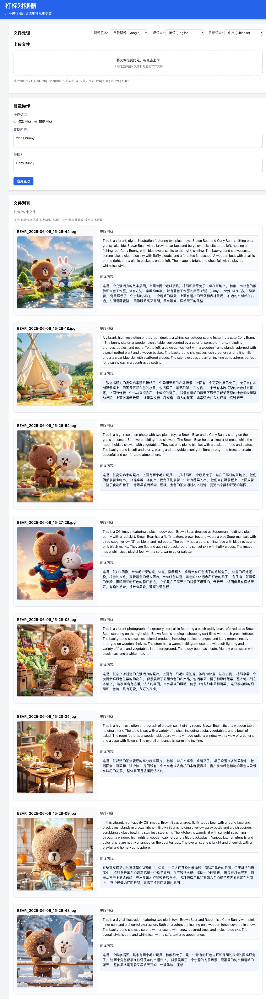

# 打标对照器

打标对照器是一个用于图片训练集打标更改的工具，允许您上传图片及其对应的标记文本文件，进行翻译查看和编辑。所有图片都在前端内存中处理，不会上传到服务器。


## 功能特点

1. 支持上传图片和对应的TXT文件（每个图片文件都和txt文件一一对应）
2. 列表展示所有图片和txt文件内容，并提供多种翻译服务
3. 支持全局文本添加/替换内容，包括文本首尾添加
4. `实时翻译更改后的文本`
5. 支持多种语言翻译选择和多个翻译服务切换
6. 一键下载处理后的所有图片和txt文件

## 技术栈

- 前端：React + Tailwind CSS
- 后端：Python Flask（仅用于翻译服务）
- 翻译：Translators 库（支持多种翻译服务）

## 支持的翻译服务

- 谷歌翻译 (Google)
- 必应翻译 (Bing)
- 百度翻译 (Baidu)
- 有道翻译 (Youdao)
- 腾讯翻译 (Tencent)
- 阿里翻译 (Alibaba)
- DeepL 翻译

## 如何运行

### 后端

1. 进入backend目录：
   ```
   cd backend
   ```

2. 安装依赖：
   ```
   pip install -r requirements.txt
   ```
   
   或者使用conda安装translators：
   ```
   conda install conda-forge::translators
   pip install flask==2.2.3 flask-cors==3.0.10 python-dotenv==1.0.0 requests>=2.32.2 Werkzeug==2.2.3
   ```

3. 运行服务器：
   ```
   python app.py
   ```

### 前端

1. 进入frontend目录：
   ```
   cd frontend
   ```

2. 安装依赖：
   ```
   npm install
   ```

3. 运行开发服务器：
   ```
   npm start
   ```

4. 在浏览器中访问：`http://localhost:3000`

## 使用说明

1. 上传文件：
   - 拖拽图片文件和对应的TXT文件到上传区域或点击上传区域选择文件
   - 确保每个图片文件都有一个同名的TXT文件（例如：image1.jpg 和 image1.txt）

2. 选择翻译设置：
   - 在页面顶部选择需要的翻译服务（谷歌、百度、有道等）
   - 选择目标翻译语言（英语、中文、日语等）

3. 编辑单个文件：
   - 点击列表中每个文件的"编辑文本"按钮进行文本编辑
   - 编辑完成后点击"保存"按钮保存更改，文本将自动重新翻译

4. 批量操作：
   - 选择"添加内容"或"替换内容"操作类型
   - 根据需求填写相应内容
   - 点击"应用更改"按钮执行批量操作

5. 下载文件：
   - 点击页面底部的"下载标记文件"按钮下载处理后的所有文件
   - 文件将打包为ZIP格式下载到本地

## 注意事项

- 所有图片处理都在浏览器中进行，不会上传到服务器
- 翻译功能使用 Translators 库 6.0.1 版本，可能需要网络连接和合理使用
- 不同翻译服务可能有不同的速率限制和可用性
- 当前版本不支持在前端处理ZIP文件，请直接上传图片和对应的TXT文件

